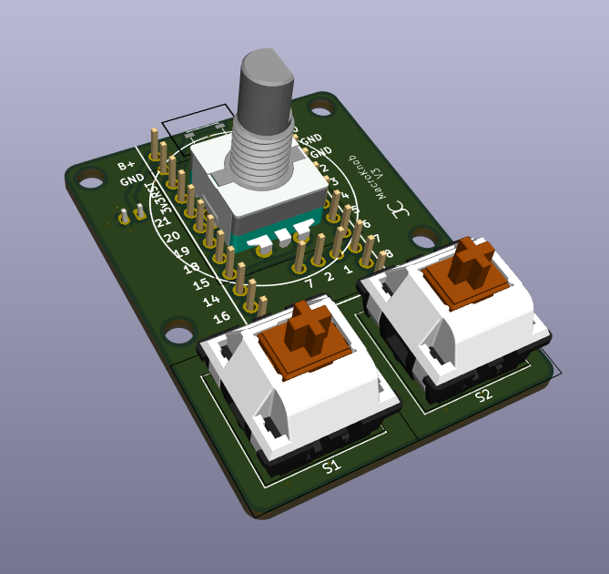

# macroknob

A simple 2-key, 1 rotary encoder shield for ZMK. Designed to complement any ZMK keyboard as a dongle.

This repo contains the PCB and case files for the MacroKnob. The software (shield config) can be found here: https://github.com/theepicflyer/macroknob-shield.
